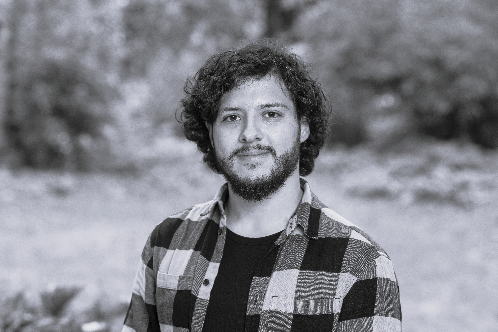

```{=html}
<style>.quarto-title-block { display: none; }</style>
```

::: {.hero-shell}
::: {.hero-copy}
<p class="eyebrow">SOCIOLOGY OF EDUCATION · SOCIAL NETWORK ANALYSIS</p>

# How relationships and institutions shape educational opportunity

I am a **DPhil researcher in Education at the University of Oxford**, funded by the UK's Economic and Social Research Council. My work examines how gender, institutional prestige, and social ties shape academic careers and educational trajectories.

::: {.hero-actions}
[Explore my research](projects.qmd){.btn .btn-primary .btn-lg}
[Download CV](files/Montero_CV.pdf){.btn .btn-outline-primary .btn-lg target="_blank"}
:::

::: {.research-tags}
<span>Educational inequality</span><span>Social networks</span><span>Gender</span><span>Quantitative methods</span>
:::
:::

::: {.hero-portrait}
{fig-alt="Portrait of Matías Montero"}

::: {.portrait-note}
**Matías Montero**<br>
DPhil in Education · University of Oxford<br>
ESRC Grand Union DTP Scholar
:::
:::
:::

::: {.section-intro}
<p class="eyebrow">RESEARCH AGENDA</p>

## Connecting structures, relationships, and outcomes

My research moves across higher education, schools, and classrooms, using longitudinal and relational methods to understand when institutions reproduce inequality - and when they create room for change.
:::

::: {.research-grid}
::: {.research-card}
<span class="card-number">01</span>

### Academic careers

How gender and institutional prestige influence collaboration, research funding, leadership, and attrition across education researchers' careers.
:::

::: {.research-card}
<span class="card-number">02</span>

### Educational transitions

How stratified systems shape course choices, higher-education access, and the trajectories of migrant and international students.
:::

::: {.research-card}
<span class="card-number">03</span>

### Relational methods

How social network analysis and quantitative research can reveal the mechanisms linking opportunity structures to educational outcomes.
:::
:::

::: {.home-band}
::: {.home-band-copy}
<p class="eyebrow light">CURRENT DOCTORAL WORK</p>

## Networks and gender disparities across academic careers

My DPhil investigates the formation and persistence of gender disparities in Latin American education research. I model co-authorship and funding networks over time to examine how individual careers and institutional contexts interact.

[View research projects →](projects.qmd){.band-link}
:::

::: {.home-band-facts}
<div><strong>Oxford</strong><span>Department of Education</span></div>
<div><strong>Longitudinal</strong><span>Network perspective</span></div>
<div><strong>Latin America</strong><span>Regional focus</span></div>
:::
:::

::: {.home-columns}
::: {.home-latest}
<p class="eyebrow">LATEST</p>

## Recent activity

::: {.mini-timeline}
::: {.mini-event}
<span class="mini-date">13 AUG 2026</span>

Presented *Who Gets Picked?* at the 8th European Conference on Social Networks (EUSN 2026) in Norrköping, Sweden.
:::

::: {.mini-event}
<span class="mini-date">APR-JUN 2026</span>

Visiting Doctoral Researcher at Universidad Mayor's Society and Health Research Centre.
:::

::: {.mini-event}
<span class="mini-date">MAR 2026</span>

Published a comparative PISA study of pathways to gender equity in mathematics in *Studies in Educational Evaluation*.
:::
:::

[See the full timeline →](news.qmd)
:::

::: {.home-output}
<p class="eyebrow">FEATURED OUTPUT</p>

## Gender segregation in secondary-school course choices

This *American Educational Research Journal* article examines socioeconomic gradients and the protective role of school gender culture in Chile.

**Ortega, Montero, Canals & Mizala (2025)**<br>
[Read the article](https://doi.org/10.3102/00028312241308537){.btn .btn-sm .btn-outline-primary}
:::
:::

::: {.contact-strip}
<p class="eyebrow">CONNECT</p>

## Interested in education, networks, or quantitative methods?

[Email me](mailto:matias.montero@education.ox.ac.uk) · [ORCID](https://orcid.org/0000-0003-1610-2477) · [Google Scholar](https://scholar.google.com/citations?user=Bsr3stIAAAAJ&hl=en) · [GitHub](https://github.com/monteromati)
:::
